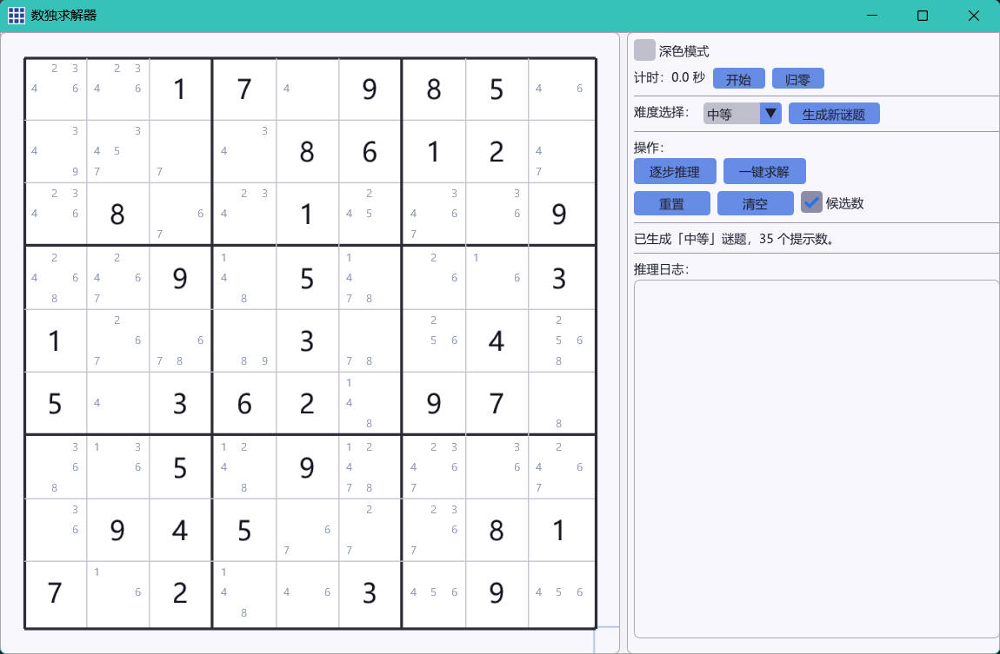

# 数独求解器 (Sudoku Solver)

交互式数独求解桌面应用，C++17 + ImGui + OpenGL3。

## 功能

- **随机生成谜题** — 可选简单/中等/困难/专家四种难度，保证唯一解
- **手动输入谜题** — 空白棋盘直接填数，实时冲突高亮（红色标记）
- **逐步推理** — 单步执行约束传播+回溯搜索，展示每步逻辑
- **一键求解** — 完整求解并检测多解情况
- **候选数显示** — 切换显示每格的候选数字

## 算法

分两阶段求解：

1. **约束传播** — Naked Single（唯余法）+ Hidden Single（隐式唯一），模拟人类推理
2. **回溯搜索** — MRV 启发式选格 + 递归回溯，保证求解

多解检测：找到第一个解后继续搜索，若找到第二个解则标记"非唯一解"。

## 技术栈

- C++17
- [Dear ImGui](https://github.com/ocornut/imgui) (OpenGL3 + Win32)
- MinGW64 (GCC 15.1.0)
- CMake 3.28+

~~游玩《川岛博士的脑部锻炼》而作~~
